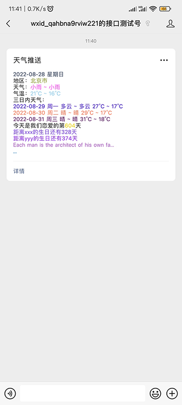

# wechat-weather-push



### 获取高德地图天气key
进入[https://lbs.amap.com/](https://lbs.amap.com/) 登录后进入控制台，创建应用获得Key


### 配置微信公众平台接口

https://mp.weixin.qq.com/debug/cgi-bin/sandbox?t=sandbox/login


扫描二维码关注测试公众号


新增测试模板


模板内容

```
{{date.DATA}}
地区：{{city_name.DATA}}
天气：{{today_weather.DATA}}
气温：{{today_temp.DATA}}
三日内天气：
{{tomorrow.DATA}}
{{tomorrow2.DATA}}
{{tomorrow3.DATA}}
今天是我们恋爱的第{{love_day.DATA}}天
{{birthday1.DATA}}
{{birthday2.DATA}}
{{note_en.DATA}}
{{note_ch.DATA}}
```

提交后获得模板ID

### 修改config.txt

```
{
# 公众号配置
# 公众号appId
"app_id": "xxx",
# 公众号appSecret
"app_secret": "xxx",
# 模板消息id
"template_id": "xxx",
# 接收公众号消息的微信号，如果有多个，需要在[]里用英文逗号间隔，例如["wx1", "wx2"]
"user": ["xxx"],

# 信息配置
# 高德地图天气apikey
"weather_key": "xxxx",
# 所在城市的编码，参考 Amap_adcode_citycode_20210406.xlsx
"citynumber": "110000",
# 生日1，修改名字为对应需要显示的名字，如果生日为农历，在最前面加上r即可
"birthday1": {"name": "xxx", "birthday": "1998-07-22"},
# 生日2
"birthday2": {"name": "yyy", "birthday": "r1998-07-22"},
# 在一起的日子，格式同上，暂不不支持农历
"love_date": "2021-01-01",
# 金句中文，如果设置了，则会显示这里的，如果为空，默认会读取金山的每日金句
"note_ch": "",
# 金句英文
"note_en": ""
}
```


将```app_id```  ```app_secret```  ```template_id```  ```weather_key```改成你自己的

```citynumber```是城市的编号，可查找```citycode_20210406.xlsx```

